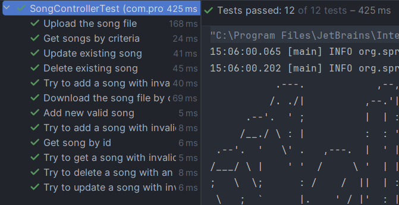

# Завдання до 2 модулю

Для того, щоб запустити код достатньо виконати наступну команду:

```git clone https://github.com/bereeza/profit_soft_web```

Важливо додати, що додаток використовує liquibase 4.27.0 версії. 
Скрипт запускається під час компіляції і заповнює сутність Artist 3 записами. 
(важливо не встановлювати spring.jpa.hibernate.ddl-auto = create-drop, оскільки воно почистить таблицю з Artist).

Якщо прибрати liquibase з pom.xml - можна отримати той самий результат, 
запустивши скрипт init.sql. По суті, він робить те саме (2 таблиці, заповнення Artist та індекси).

Сутності мають вигляд:

* Artist (один артист - багато пісень)
```java
public class Artist {
    private long artistId;
    private String artistName;
    private String artistCountry;

    @OneToMany(mappedBy = "artist")
    private List<Song> songs;
}
```

* Song (багато пісень - один артист)
```java
public class Song {
    private long id;
    private String title;
    private Float duration;
    private String album;
    private String genre;

    @ManyToOne
    private Artist artist;
}
```
Також, для маніпулювання сутностями були додані відповідні DTO

Важливо, що в цьому модулі я захотів спробувати підключити
Swagger до свого Rest сервісу. Додатково з Postman можна використовувати 
Swagger за адресою: http://localhost:8080/swagger-ui/index.html

# Контролери

В додатку присутні всього 2 контролери:
1) ArtistController - для маніпулювання з сутністю Artist
2) SonController - для маніпулювання з сутністю Song

# Тести
В цьому модулі я вперше спробував використати h2 і додав відповідний файл .properties
в тестах контролерів. 

Результат для ArtistControllerTest:


Результат для SongControllerTest:


# Додатково
Також, хочу навести приклади деяких запитів через Postman:

* Завантаження даних через upload endpoint


* Пагінація пісень 

Запит:
```json
{
    "album": "The End Is Where We Begin",
    "startPage": 0,
    "size": 2
}
```


* Отримання csv

